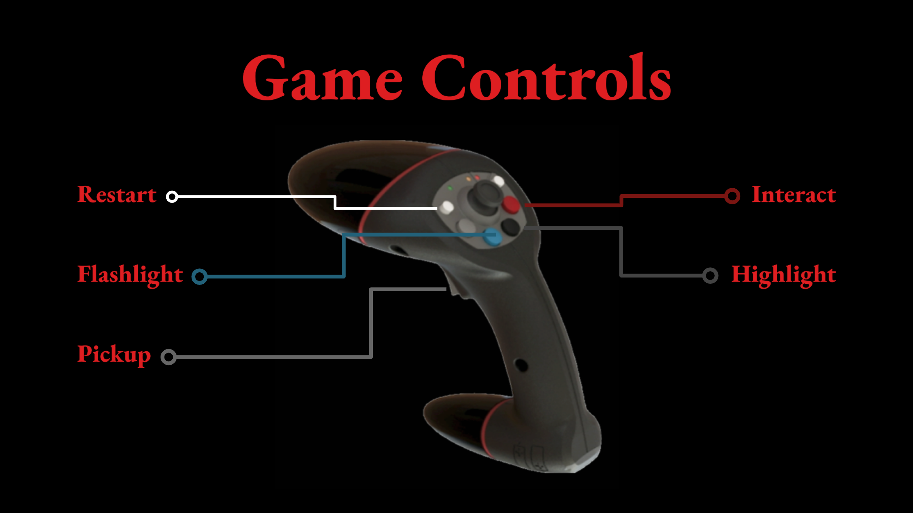
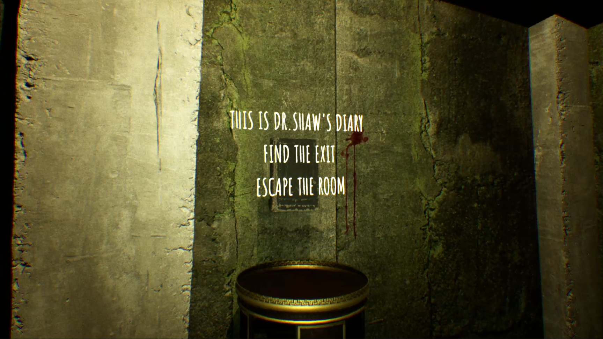
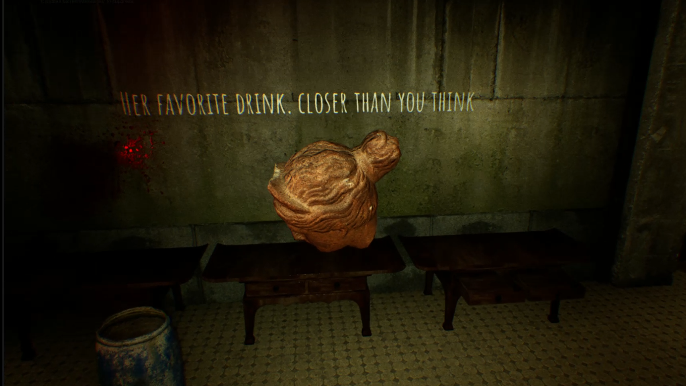
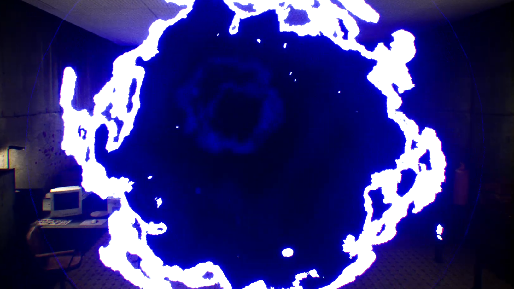
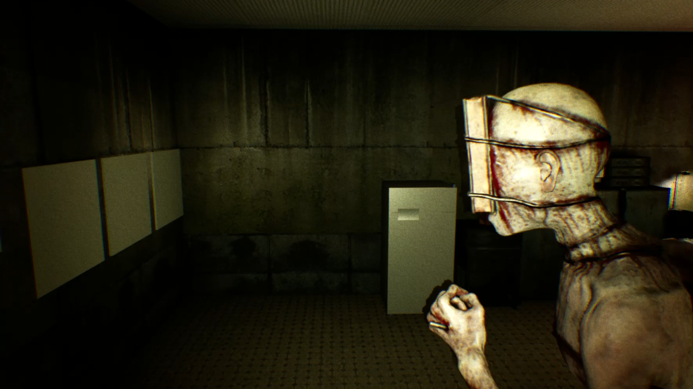
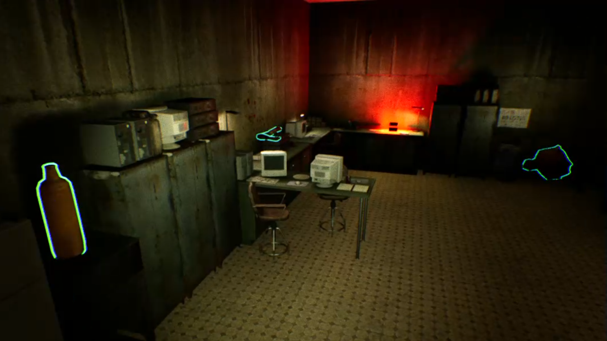
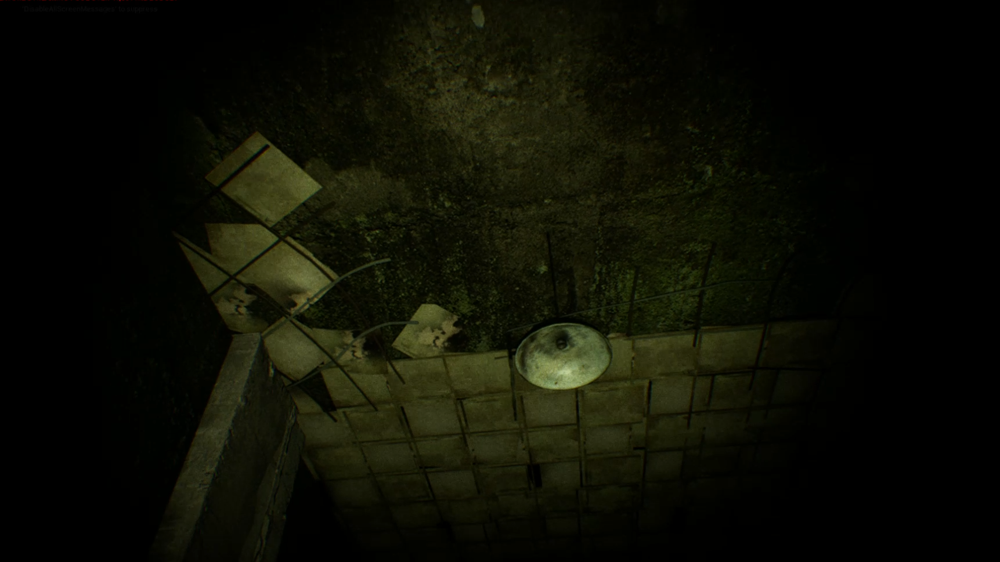

# The Hiddens

**The Hiddens** is a VR escape room project developed for the **LED CAVE at the Leibniz Supercomputing Centre (LRZ)**.  
The experience combines **environmental storytelling**, **horror atmosphere**, and **puzzle-based interaction** inside a mysterious apartment environment.

Players take on the role of an investigator following a missing person case. After entering the apartment, they become trapped in a disturbing, crime-scene-like space and must uncover clues, solve puzzles, and reveal the hidden story behind the scene.

[Hands-on experience on Open Lab Day 2024 at LRZ](https://openlabday24.v2c.lrz.de/)

For teaser: [Teaser](https://youtu.be/25tzcKgVytU)

For full game play video: [Full Game Play](https://youtu.be/MLnuCygSu2c)

---

## Project Overview

- **Project Type:** VR Escape Room
- **Platform:** LED CAVE
- **Location:** Leibniz Supercomputing Centre (LRZ)
- **Engine:** Unreal Engine
- **Genre:** Horror / Puzzle / Narrative Exploration

---

## Controls

| Action | Function |
|--------|----------|
| Restart | Restart the game |
| Interact | Trigger object interaction |
| Pickup | Pick up and carry objects |
| Highlight | Show interactable objects in range |
| Flashlight | Toggle flashlight for dark areas |

---

## Technical Implementation

### Pickup System
Players can grab and carry physics-enabled objects as part of the puzzle flow.

- Uses line trace from the controller (joystick)
- Objects are handled with a physics handle
- Tuned for more stable object movement

### Puzzle Logic
Objects must be placed in the correct location based on puzzle conditions.

- Overlap-based validation
- Checks object type and properties
- Correct placement locks the object and updates progress
- Light feedback indicates success

### Portal VFX
A procedural portal material was created to enhance the supernatural atmosphere.

- Built with animated noise textures
- Uses radial masks for shape and glow
- Designed as a lightweight real-time effect

### Dynamic Jumpscare System
This system creates a one-time jumpscare by triggering a fast-moving AI character and synchronized sound when the player crosses a trigger zone.

- Implemented with a Character Blueprint and skeletal mesh
- Uses a single animation asset for lightweight setup
- Triggered through a level-based overlap event
- AI navigates to a target point using `AI Move To`
- A jumpscare sound effect is played on trigger
- The actor is removed after completing its path
- Speed tuning was used to control the intensity of the scare
  

### Highlight System
A custom outline material highlights objects when the player is within interaction range.

- Material-based outline in Unreal Engine
- Triggered by overlap detection
- Helps guide attention in dark scenes

### Flashlight

---

## Design Focus

The project explores how the LED CAVE can support immersive horror experiences through:

- spatial presence
- environmental storytelling
- puzzle-based exploration
- visual tension and atmosphere

## Contributions

| Contributor | Role | Contact |
|-------------|------|---------|
| **Shiyi Gou** | Team Lead, Unreal Engine Developer, Technical Artist | goumaja@gmail.com |
| **Can Yang** | Environmental Artist | Can.Yang@campus.lmu.de|
| **Yousri Cherif** | Environmental Artist | Cherif.Yousri@campus.lmu.de |

